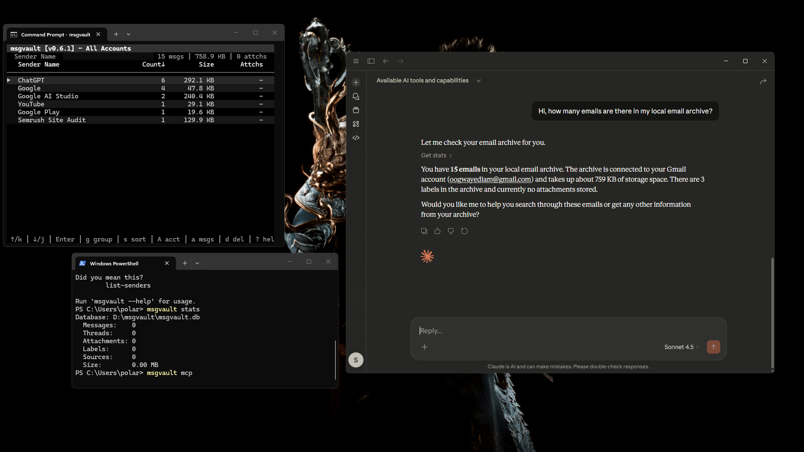

# msgvault - Exploration Notes

## What I set up / ran

- Successfully set up msgvault and ran it both via the TUI and as a local MCP server.
- Created a Gmail `client_secret.json` via Google Cloud Console and completed the OAuth flow.
- Synced a subset of emails from my Gmail account and verified that they were indexed and accessible via TUI and MCP Tool.
- Tested some TUI view modes and features like searching, grouping, and staged deletion.

---

## Observations & Insights

- msgvault is created from a privacy and local-first perspective. The ability to run it locally (including as an MCP server) is actually a strong design choice, aligns perfectly with the perspective. 
- As far as the storage and accessibility is concerned, I found that msgvault uses a layered architecture to give safety and speed.
   
| Layer | Technology | Purpose |
|-------|------------|---------|
| System of Record | SQLite | Safety. It stores the full MIME bodies, attachments, and metadata. It's the "source of truth." |
| Search Engine | SQLite FTS5 | Text Search. Used when you search for a specific word inside an email body. |
| Analytics Cache | Parquet + DuckDB | Aggregation. Used for the TUI to instantly show charts, top senders, and counts across emails. |

- While running the TUI, it automatically builds Analytics Cache and stores the records as `.parquet` files under `.msgvault\analytics\` folder. DuckDB does the querying on these denormalized (already joined) records and in turn we get faster aggregation even on large archives. 

- The search is powered by FTS5 (Full-Text Search). This is specialized "Virtual Table" in SQLite that works in "Inverted Index" manner.
  - **Standard Table**: `Email #10` contains the words ["Meeting", "Project", "Update"]
  - **FTS5 Index**: The word `"Project"` is found in `Email #10, #45, #101, #200`.

  This makes the look up faster, because now the searching occurs via FTS5 index instead of looking for the words in the emails.

- It can be used as a local MCP Server that can perform read-only actions via AI assistants on the local archives of the msgvault. This makes it possible to make natural lanugage queries to the archive.   One thing to note is neither this architecture makes any changes on the real Gmail Account via AI assistants nor the assistants have any capability to send emails, delete messages, or access google credentials.  

---

## Challenges & How I approached them

- The OAuth Setup required careful attention to scopes and credential configuration, so I validated each step incrementally before moving onto syncing data.

- I observed the multi-layer storage architecture and was curious why and how they are needed, I understood this using bottom to top approach, first observing what purpose SQLite is serving, and how Parquet & DuckDB is building on top of this. This was unravelled by the flow of the data. One layer is just storing it while other layer is making use of it to showcase the information with better UX and optimized speed. 

With more time, I’d like to trace specific query paths (e.g., search vs aggregation) to better understand how data moves between SQLite, FTS5, and Parquet-backed analytics.

## Screenshots

- ### Running TUI 

- ### Running msgvault MCP Server 

<i>Claude Desktop using msgvault mcp tool</i>

*Note:* *One behavior I noticed during exploration was that running the MCP server and the TUI simultaneously (in separate terminals) didn’t seem to work as expected - whichever process was started first functioned correctly, while the second did not pull up data.*

*This may be an intentional design choice, possibly related to exclusive access to the local SQLite database or avoiding concurrent reads/writes from multiple processes. With more time, I’d look into whether this is a documented constraint or if there’s a recommended way to run these components concurrently.*

 