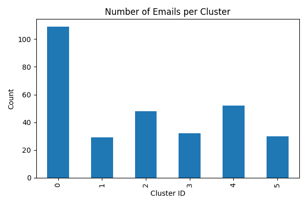

# Clustering Results - Semantic Email Grouping

Below are example subjects from each cluster, along with an interpreted theme.

## Cluster 0 - Mixed Informational

- Updates to our Terms & Privacy Policy
- Build failed for tech-polarity-backend
- Notes, handled for you
- [Product Update] Automatic enablement of new OpenTelemetry ingestion API

Observation: Acts as a catch-all cluster for informational and update-style emails.

## Cluster 1 - Product Recommendations
- We found something you might like
- Keep shopping your recent finds on Amazon

Observation: Very clean cluster dominated by repeated recommendation templates.

## Cluster 2 - Urgency / Action Required
- ACTION REQUIRED: Update your credit card
- [GitHub] Your personal access token is about to expire
- [Action Required] More information is needed to verify your account

Observation: Groups emails with urgent, action-driven intent across platforms.

## Cluster 3 - E-commerce Transactions
- Delivered: 1 item | Order #
- Your return for Amazon order
- Upcoming COD Order today?

## Cluster 4 - Promotional (Audio / Plugins)
- Yout Path to a Pro Mix 
- Limited-Time Drop $10 UAD Plug-Ins

## Cluster 5 - Education / LMS Notifications
- New Assignment Released | IITGDS
- Reminder - Live Session at 8:00 PM

---

## Cluster Distribution Plot

---

## Notes

- Embeddings captured intent well even with subject + snippet only.
- K-Means produced clean clusters for transactional and promotional emails.
- Mixed cluster emerged due to short snippets and newsletter-style content.
- With more time, density-based clustering and thread-level aggregation could improve separation.

